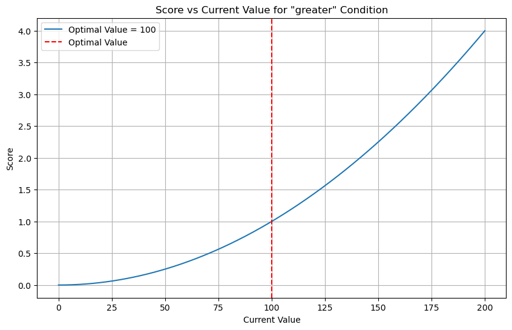
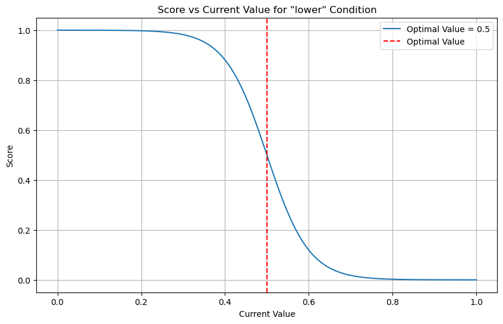
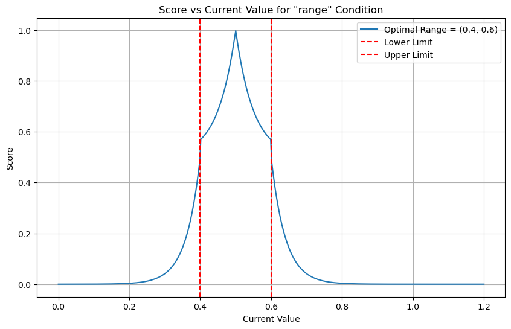

# Installation

Assumption: You have already installed **HACS**, **AppDaemon** and **MariaDB**.
1. If you do not have HACS installed, please follow the instructions here: https://hacs.xyz/docs/installation/manual.
2. If you do not have AppDaemon installed, please follow the instructions here:https://appdaemon.readthedocs.io/en/latest/INSTALL.html
3. If you do not have MariaDB installed, please follow the instructions here: https://github.com/home-assistant/addons/blob/master/mariadb/DOCS.md


This repository is not part of the default HACS store. To add it to your HACS, you need to add it as a
custom repository. To do this, go to the HACS settings and add the following URL as a custom repository and choose
'AppDaemon' as the category:

Enter this URL: https://github.com/gpala7077/regex_smart_home.git

It will look like this:
  <div style="display: flex; justify-content: space-around;">
  <div></div>
  </div>


# Configuration
This is best used when you have a standardized naming convention for your entities. 

It assumes the following naming convention:
domain.room_device_type
or 
domain_room_device_type_sensor

so for example:
- humidifier.living_room_humidifier
- sensor.living_room_humidifier_current_humidity

or
- binary_sensor.living_room_occupancy_1
- binary_sensor.living_room_occupancy_2

or 
- fan.living_room_purifier
- sensor.living_room_purifier_pm2_5


This app does not do anything it is a dependency for other apps. It must be priority 1 in 
the configuration file. 

```yaml
automations:
  module: automations
  class: Automations
  use_dictionary_unpacking: True
  plugin:
    - HASS
  hass_db_url: "mysql+mysqlconnector://<my_username>:<my_password>@<host_ip>:3306/ha_db?charset=utf8mb4&collation=utf8mb4_unicode_ci"
#  home_db_url: "mysql+mysqlconnector://<my_username>:<my_password>@<host_ip>:3306/home_db?charset=utf8mb4&collation=utf8mb4_unicode_ci"
  areas:
    - kitchen
    - living_room
    - bedroom
    - office
    - bathroom_guest
    - bathroom_master
    - hallway
  priority: 1 # Must be first in the list before any of my other apps
```

# Usage
This app does not do anything it is a dependency for other apps. It must be priority 1 in order list of AppDaemons. 
Particularly with any of my other apps. This app is a collection of utility functions that are used by other apps to 
standardize the way entities are controlled. 

To get the most use out of this app, you should have a standardized naming convention for your entities. The naming 
convention should be domain.room_device_type or domain_room_device_type_sensor. All entities available to Home assistant
should follow this naming schema. I know this may sound daunting, but trust me that in the long run it will make your
life easier.  

# Main functions

## Get Matching Entity / Command Matching Entity

At the heart of this app is the get_matching_entity and its extension command_matching_entity. These functions are used
to filter and search through entities within Home Assistant. This allows for great flexibility in writing automations 
that are dynamic but could also be used for multiple rooms. 

Let's have a simple use case. You are writing an automation that requires you to check the status of the oil diffusers.
```python
oil_diffusers = self.get_matching_entities(
    domain='humidifier',
    pattern='oil_diffuser'
)

```
Would return a dictionary with all the entities that matched the ReGex Pattern along with their states.
```json
{
  'humidifier.office_oil_diffuser': 'on', 
  'humidifier.living_room_oil_diffuser': 'off', 
  'humidifier.hallway_oil_diffuser': 'on', 
  'humidifier.bathroom_guest_oil_diffuser': 'off'
}
```

Let's try a more complicated exampled. Let's say you only want to control the oil diffusers in the rooms that are 
current occupied and only if they are on.
```python

# Returns an aggregated dictionary count of all the rooms that are currently occupied
rooms_with_occupancy = self.get_matching_entities(
    domain='binary_sensor',
    pattern='occupancy',
    get_attribute='area',
    agg_func='count',
    index='area',
    device_state='on',
)
# {'office': 3}
rooms_with_occupancy = list(rooms_with_occupancy.keys())

oil_diffusers = self.get_matching_entities(
    area=rooms_with_occupancy,
    domain='humidifier',
    pattern='oil_diffuser',
    device_state='on'
)

```

Would return a dictionary with all the entities with an active room and turned on.
```json
{
  'humidifier.office_oil_diffuser': 'on', 
}
```


# Available Algorithms
The following algorithms are available for use in the app.

## Scoring Algorithm

The scoring algorithm is a versatile tool used to evaluate the relationship between current and optimal values across
various conditions. It is designed to work under three primary conditions: 'greater', 'lower', and 'range', each with
its unique scoring dynamics.

##### Condition: 'greater'

**Functionality**: The algorithm calculates a score that increases exponentially as the current value approaches or
exceeds the optimal value. The 'steepness' parameter influences the rate of this increase.

$$ \text{Score} = \left( \frac{\text{CurrentValue}}{\text{OptimalValue}} \right) ^{\text{steepness}} $$

##### Condition: 'lower'

**Functionality**: The score is determined using a sigmoid function. The score is 0.5 when the
current value equals the optimal value and decreases exponentially as the current value surpasses the optimal value.

$$ \text{Score} = \frac{1}{1 + e^{\text{scaler} \times \left( \frac{\text{CurrentValue}}{\text{optimalValue}} - 1
\right)}} $$

##### Condition: 'range'

###### Inside the Range

**Functionality**: For values within the optimal range, the score increases exponentially towards the mid-point of the
range

$$
\text{Score} =
\begin{cases}
0.5 + 0.5 \times e^{\text{InsideScaler} \times (1 - \text{NormalizedValue})} & \text{if } \text{NormalizedValue}
\leq 1 \\
0.5 + 0.5 \times e^{\text{InsideScaler} \times (\text{NormalizedValue} - 1)} & \text{if }
\text{NormalizedValue} > 1
\end{cases}
$$

Where $$\text{NormalizedValue} = 2 \times \frac{(\text{CurrentValue} - \text{LowerLimit})}{(
\text{UpperLimit} - \text{LowerLimit})}$$

###### Outside the Range

**Functionality**: When the current value falls outside the optimal range, the score decreases exponentially, with a
more
rapid decline the further the value is from the range.

$$
\text{Score} = 0.5 \times e^{\text{OutsideScaler} \times \frac{\text{distance}}{(\text{UpperLimit} -
\text{LowerLimit})}}
$$

Here, $$\text{distance}$$ is the minimum absolute difference between the current value and the nearest limit of the
optimal range.

#### Visualizations of the Scoring Algorithm

  <div style="display: flex; justify-content: space-around;">
  <div></div>
  <div></div>
  <div></div>
  </div>
